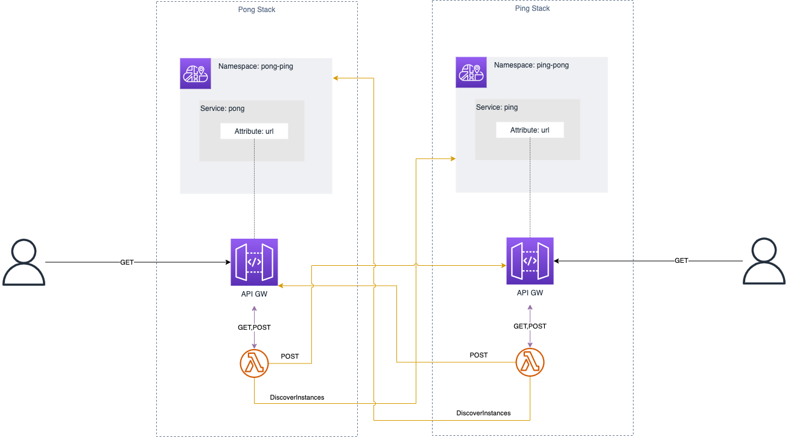

# aws-cdk-service-discovery-example

Quick example of using AWS Cloudmap to look up APIs by namespace and service name.

## Architecture

The project has two stacks "ping-stack" and "pong-stack". Each stack consists of an API Gateway backed by a Lambda function. 
The API Gateway endpoint url is registered as a custom attribute of a specific service name ("ping" or "pong") under an AWS Cloud Map [HttpNamespace](https://docs.aws.amazon.com/cloud-map/latest/api/API_CreateHttpNamespace.html)

When a Http GET request is sent to the API gateway the backing lambda will look up the other service using the [DiscoverInstances](https://docs.aws.amazon.com/cloud-map/latest/api/API_DiscoverInstances.html) method and make an Http POST to the other api using the url registered with the discovered service. The output is then returned to the user.

## Deployment

* `npm install`   installs dependencies
* `npm run build`   compile typescript to js
* `cdk deploy --all`  deploy the stacks to your default AWS account/region
